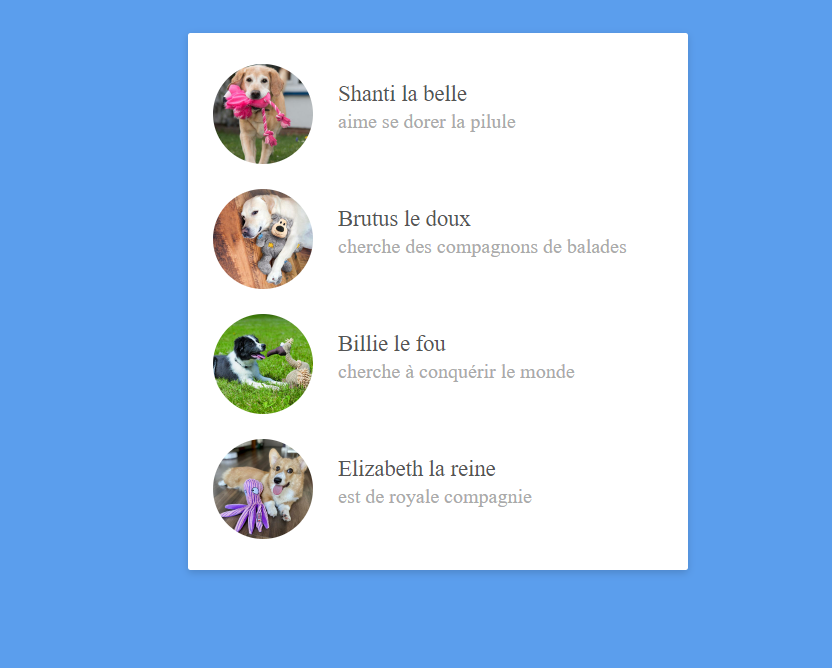

# Exercice Dog List

Réalisez l'intégration suivante grâce au flexbox

## Tout savoir sur le Flexbox (ressources)

[Flexbox - The Ultimate CSS Flex Cheatsheet](https://www.freecodecamp.org/news/flexbox-the-ultimate-css-flex-cheatsheet/)

[A Complete Guide to Flexbox](https://css-tricks.com/snippets/css/a-guide-to-flexbox/)

[Learn basic Flexbox in just 10 minutes](https://www.freecodecamp.org/news/flexbox-in-10-minutes-7295497804ed/)

[Les concepts de base pour flexbox](https://developer.mozilla.org/fr/docs/Web/CSS/CSS_Flexible_Box_Layout/Concepts_de_base_flexbox)